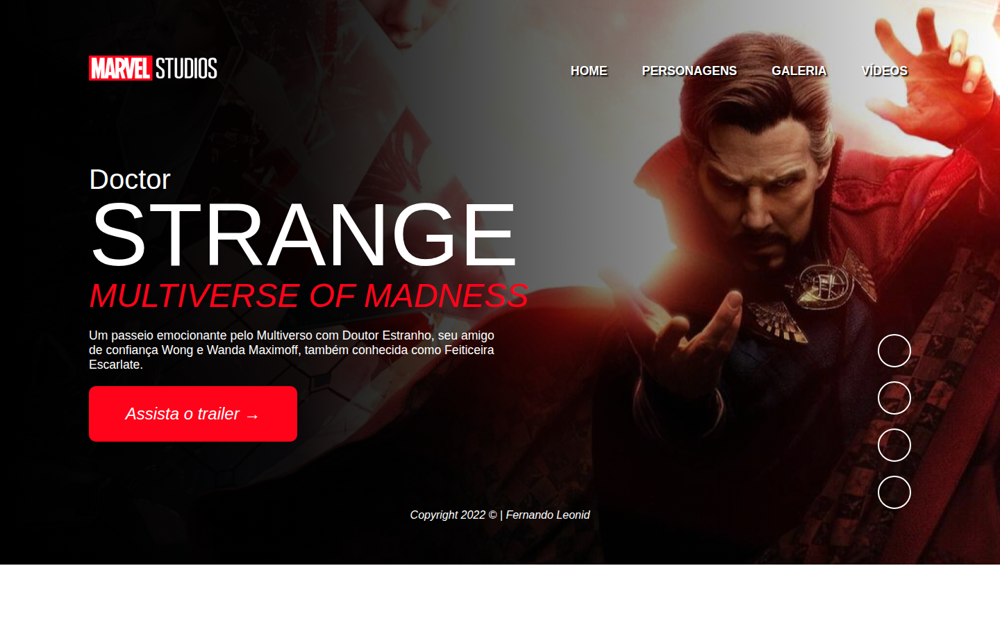
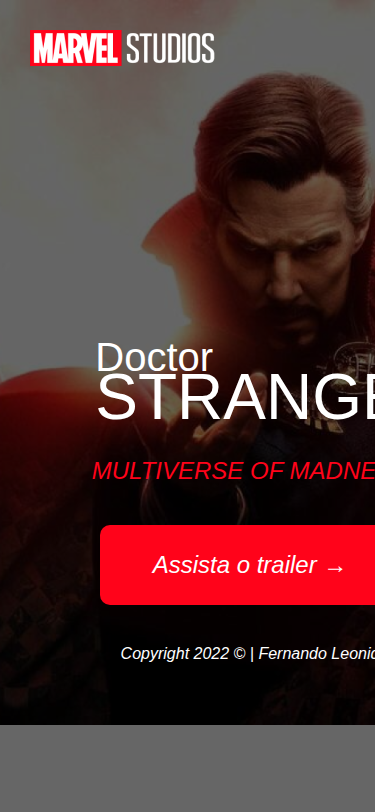

<h1 align="center">🎬 Doctor Strange – Multiverse of Madness</h1>

<p align="center">
  
  
  
  
</p>

<p align="center">
  Landing page temática do filme <strong>Doctor Strange no Multiverso da Loucura</strong> (Marvel, 2022),
  desenvolvida com HTML, CSS e JavaScript puro como projeto prático de front-end.
</p>

---

## 📸 Layout

### 🖥️ Desktop



### 📱 Mobile

<p align="center">
  
</p>

---

## 🚀 Tecnologias utilizadas

| Tecnologia | Descrição |
|---|---|
| **HTML5** | Estrutura semântica das páginas |
| **CSS3** | Estilização, animações e responsividade |
| **JavaScript (ES6+)** | Interatividade (menu hamburguer) |
| **Google Fonts** | Tipografias Mulish e Roboto |
| **Font Awesome** | Ícones das redes sociais |

---

## 📁 Estrutura do projeto

```
strange-2022/
├── index.html              # Página principal (Home)
├── css/
│   ├── reset.css           # Reset de estilos padrão do navegador
│   ├── style.css           # Estilos globais e background
│   ├── header.css          # Estilos do cabeçalho e navegação
│   ├── main.css            # Estilos do conteúdo principal
│   ├── footer.css          # Estilos do rodapé
│   └── menu-burger.css     # Estilos do menu hamburguer (mobile)
├── js/
│   └── main.js             # Lógica do menu hamburguer
├── img/
│   ├── logo-marvel.png     # Logotipo da Marvel
│   ├── background.png      # Imagem de fundo do Doctor Strange
│   └── screenshots/        # Capturas de tela do projeto
├── pages/
│   ├── personagens.html    # Página de personagens
│   ├── galeria.html        # Página de galeria
│   └── videos.html         # Página de vídeos
└── README.md
```

---

## ✨ Funcionalidades

- [x] Layout full-screen com imagem de fundo
- [x] Animação de zoom na entrada da página
- [x] Menu de navegação com múltiplas páginas
- [x] Menu hamburguer para dispositivos móveis
- [x] Links para redes sociais
- [x] Botão de CTA (Call to Action) direcionando ao trailer
- [x] Design totalmente responsivo (desktop e mobile)
- [x] Uso de variáveis CSS (custom properties)

---

## 🎨 Conceitos abordados

Este projeto é ideal para aprender e praticar os seguintes conceitos de front-end:

### HTML
- Estrutura semântica (`header`, `main`, `footer`, `nav`)
- Links internos e externos
- Ícones com Font Awesome via CDN
- Importação de fontes via Google Fonts

### CSS
- **Variáveis CSS** (`--accent-color`)
- **Flexbox** para alinhamento e layout
- **Background** com gradiente + imagem (`background-blend-mode`)
- **Animações** com `@keyframes` e `transform: scale()`
- **Responsividade** com `@media queries`
- **Transições** suaves com `transition`
- **Pseudo-classes** (`:hover`)
- Organização em múltiplos arquivos CSS

### JavaScript
- Seleção de elementos com `querySelector`
- Manipulação de classes com `classList.toggle()`
- `addEventListener` para eventos de clique

---

## 🖥️ Como executar o projeto

Por ser um projeto estático (HTML, CSS e JS puro), **não precisa de instalação ou servidor**.

### Opção 1 – Abrir diretamente no navegador

1. Faça o download ou clone o repositório:
   ```bash
   git clone https://github.com/fernandoleonid/strange-2022.git
   ```
2. Navegue até a pasta do projeto
3. Abra o arquivo `index.html` no seu navegador

### Opção 2 – Usar a extensão Live Server (VS Code) ⭐ Recomendado

1. Instale a extensão [Live Server](https://marketplace.visualstudio.com/items?itemName=ritwickdey.LiveServer) no VS Code
2. Clique com o botão direito no `index.html`
3. Selecione **"Open with Live Server"**

---

## 📐 Design Responsivo

O projeto adapta o layout para diferentes tamanhos de tela usando `@media queries`:

| Breakpoint | Comportamento |
|---|---|
| `> 768px` | Layout desktop: nav horizontal, conteúdo lado a lado, redes sociais visíveis |
| `≤ 768px` | Layout mobile: menu hamburguer, conteúdo centralizado, texto reduzido |

---

## 🎓 Para alunos

Este projeto demonstra na prática como construir uma **landing page profissional** do zero. Sugestões de exercícios:

1. **Adicione suas cores**: altere a variável `--accent-color` no `style.css`
2. **Complete as páginas**: adicione conteúdo nas páginas `personagens.html`, `galeria.html` e `videos.html`
3. **Animações extras**: crie novos `@keyframes` para outros elementos da página
4. **Novo tema**: replique a estrutura usando um tema de sua escolha (série, jogo, filme)

---

## 👨‍💻 Autor

Desenvolvido por **Fernando Leonid**

[](https://github.com/fernandoleonid)

---

<p align="center">Feito com ❤️ para fins educacionais</p>